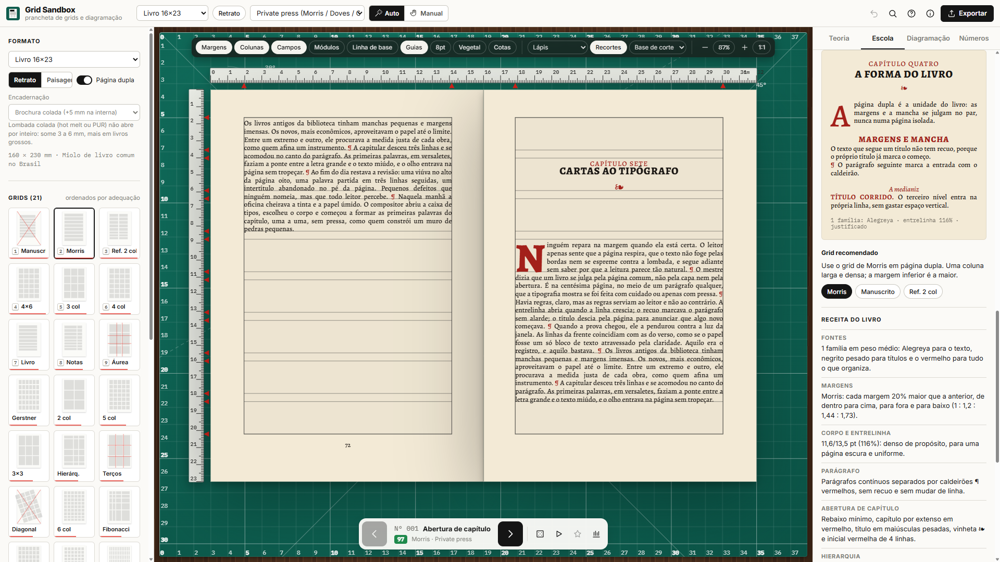

# Grid Sandbox      [](https://gridsandbox.vercel.app/)

**Prancheta digital para prototipar grids e diagramações antes de abrir o Illustrator, o Figma ou o Photoshop.**

Escolha o formato, o grid e a escola de design, percorra as combinações com ◀ ▶, ajuste à mão e exporte.


## Filosofia

O grid nasce na prancheta: folha, régua, lápis e recortes de papel reposicionados à mão até a página encontrar sua ordem. O Grid Sandbox leva esse gesto para a tela. Em vez de começar num software de produção com um documento vazio, o designer experimenta dezenas de estruturas e diagramações em segundos e só depois segue para a ferramenta final com uma decisão tomada.

O projeto tem dois públicos ao mesmo tempo: quem está **aprendendo** diagramação, que encontra a teoria explicada ao lado de cada escolha, e quem já **trabalha** com design gráfico e de interfaces, que ganha uma etapa de esboço rápido antes da produção.

### Decisões de projeto

- **Rapidez acima de tudo.** Cada combinação é gerada na hora, de forma determinística (a mesma variação sempre volta igual), e tudo tem atalho de teclado.
- **Teoria embutida.** Grids, margens e escalas seguem Müller-Brockmann, Tschichold, Van de Graaf, Gerstner e Bringhurst. Cada grid traz conceito, origem, quando usar, estratégias e erros comuns.
- **Escolas como ponto de partida.** Cada escola carrega suas fontes, paleta, grids preferidos e arquétipos de página.
- **Automático e manual.** A máquina propõe; o designer fixa o que funciona e ajusta à mão, sempre encaixado nas colunas e campos.
- **A metáfora da prancheta.** Base de corte, réguas, papel vegetal e recortes de papel com sombra, como no processo analógico de diagramação.
- **Saída utilizável.** SVG em camadas, PNG em alta resolução, CSS Grid e uma ficha técnica para refazer o grid no InDesign, Illustrator, Photoshop ou Figma.


## Recursos

1. **Formatos.** 18 formatos de impressão e tela (A4, A3, livro, cartaz, desktop, mobile, Instagram e outros), em retrato ou paisagem e com página dupla.
2. **Grids.** 21 tipos, ordenados pela adequação ao formato: colunas, modulares, Müller-Brockmann com linha de base, cânone de Van de Graaf, margens progressivas de Tschichold, livro comercial 2:3:4:6, margens de Morris, Gerstner 58, áurea, terços, Fibonacci, 8pt, diagonal construtivista e outros.
3. **Escolas.** 11 escolas e movimentos (Suíça, Bauhaus, Construtivismo, De Stijl, Nova Tipografia, Vignelli, New Wave, Japonesa, Editorial, Web/UI e Brutalismo) e 6 receitas de livro.
4. **Livros.** Diagramação de texto corrido, com a teoria por trás de cada escolha (veja abaixo).
5. **Combinações.** ◀ ▶ geram diagramações no grid escolhido, com nota e análise de espaço branco, alinhamento, hierarquia, equilíbrio e medida do texto.
6. **Modo manual.** Arraste e redimensione blocos com encaixe no grid; fixe blocos para mantê-los nas próximas combinações; desfaça e refaça.
7. **Aprender.** A aba Teoria explica o grid ativo com os números ao vivo, e o botão Construir anima o grid etapa por etapa.
8. **Exportar.** SVG em camadas, PNG (até 300 dpi, com fontes embutidas), JSON do projeto, CSS Grid e ficha técnica (com estilos de parágrafo nos livros).

## Diagramação de livros

O livro de texto corrido tem regras próprias, e as receitas do grupo **Livro** as aplicam de ponta a ponta:



- **A página dupla é a unidade** (Morris, *The Ideal Book*). Margens progressivas, interna < superior < externa < inferior: cânone de Van de Graaf (2:3:4:6), livro comercial econômico e a progressão de 20% de Morris.
- **Encadernação.** Costurada, brochura colada ou wire-o somam 2, 5 ou 10 mm à margem interna, e a análise julga as margens que sobram visíveis.
- **Medida, corpo e entrelinha.** 60–70 caracteres por linha e entrelinha de 120–145% (Bringhurst). Cada receita traz seu corpo e sua entrelinha.
- **Registro.** Intertítulos, quebras, rebaixos e figuras ocupam linhas inteiras, e as linhas coincidem nas duas páginas.
- **Hierarquia.** Até três níveis de intertítulo, cada um mudando uma só variável, com mais espaço antes que depois. Título corrido (run-in) no terceiro nível.
- **Combinação de fontes.** Uma família (Penguin, renascentista, private press), duas (Hochuli: serifada + sem serifa) ou três estilos com papéis fixos (literatura contemporânea, técnico).
- **Páginas típicas.** Abertura de capítulo com rebaixo, capitular e versaletes; intertítulos; texto corrido com quebra de seção; figura; notas de rodapé ou laterais (Tufte); sumário; folha de rosto com colofão; parte; dedicatória e epígrafe. Cabeços e fólios seguem recto e verso e somem nas aberturas.
- **Obras-primas.** Cada receita cita livros que fizeram escola na hierarquia, de Aldo Manuzio e da Doves Bible às Penguin Composition Rules e aos livros de Tufte.

| Receita | Fontes | Margens | Parágrafo e abertura |
| --- | --- | --- | --- |
| Livro renascentista | EB Garamond (1 família) | Van de Graaf | recuo, capitular de 3 linhas, versaletes |
| Clássico moderno (Penguin) | Crimson Pro (1 família) | 2:3:4:6 econômica | recuo, versaletes sem capitular |
| Private press | Alegreya (1 família) | Morris | caldeirão ¶, capitular de 4 linhas |
| Livro assimétrico suíço | Literata + Instrument Sans | com coluna de notas | alinhado à esquerda, notas laterais |
| Literatura contemporânea | Fraunces + Newsreader + Inter | 2:3:4:6 econômica | número gigante, título itálico |
| Técnico e didático | Source Serif + Source Sans + Source Code | com coluna de notas | espaço entre parágrafos, títulos numerados |

## Rodar localmente

Requer Node.js 18 ou superior.

```bash
npm install
npm run dev      # servidor de desenvolvimento em http://localhost:5173
npm test         # testes do motor de grids e do gerador de layouts
npm run build    # verificação de tipos e build de produção em dist/
```

### Deploy na Vercel

O projeto é um app Vite estático. Ao importar o repositório na Vercel, o preset **Vite** é detectado automaticamente: comando de build `npm run build` e diretório de saída `dist`.

## Atalhos

| Tecla | Ação |
| --- | --- |
| ← → | combinação anterior / próxima (no modo manual, move o bloco) |
| R | combinação aleatória |
| 1–9, [ ] | escolher / alternar grid |
| O | retrato / paisagem |
| F | página dupla |
| S / Shift+S | próxima / anterior escola |
| M | auto / manual |
| P | fixar bloco selecionado |
| Del | remover bloco |
| Espaço | autoplay |
| C | recortes de papel |
| K | construir passo a passo |
| G / L / B / U / T / D | colunas · campos · linha de base · guias · vegetal · cotas |
| + − 0 | zoom |
| E | exportar |
| Ctrl+K | paleta de comandos |
| Ctrl+Z / Ctrl+Y | desfazer / refazer |
| ? | ajuda |

O estado atual fica na URL (por exemplo `#f=a4&o=p&g=mod-4x6&s=swiss&v=0`), pronto para compartilhar, e é salvo no navegador.

## Tecnologia

React 18, TypeScript, Vite, Zustand e Framer Motion. A prancheta é desenhada em SVG nas unidades reais do documento (mm para impressão, px para tela).

- `src/core`: unidades, formatos, motor de grids, presets, escala tipográfica, gerador e avaliação de layouts
- `src/content`: escolas, textos de preenchimento e teoria
- `src/render`: prancheta em SVG, camadas do grid, réguas e tipografia
- `src/components`: interface e painéis
- `src/export`: SVG, PNG, JSON, CSS e fichas técnicas

## Website para utilizar a ferramenta

[](https://gridsandbox.vercel.app/)

## Autor

Desenvolvido por **[Diego Duenhas](https://diegoduenhas.com.br)**, designer gráfico e desenvolvedor web com mais de duas décadas de experiência em identidades visuais, projetos editoriais e interfaces digitais, da concepção gráfica à implementação front-end.

- Tecnologia em Design Gráfico, SENAC São Paulo (2026)
- Tecnologia em Sistemas para Internet, IFSP São João da Boa Vista (2017)

Contato: [dduenhas@gmail.com](mailto:dduenhas@gmail.com)

## Licença

[MIT](LICENSE) © 2026 Diego Duenhas
